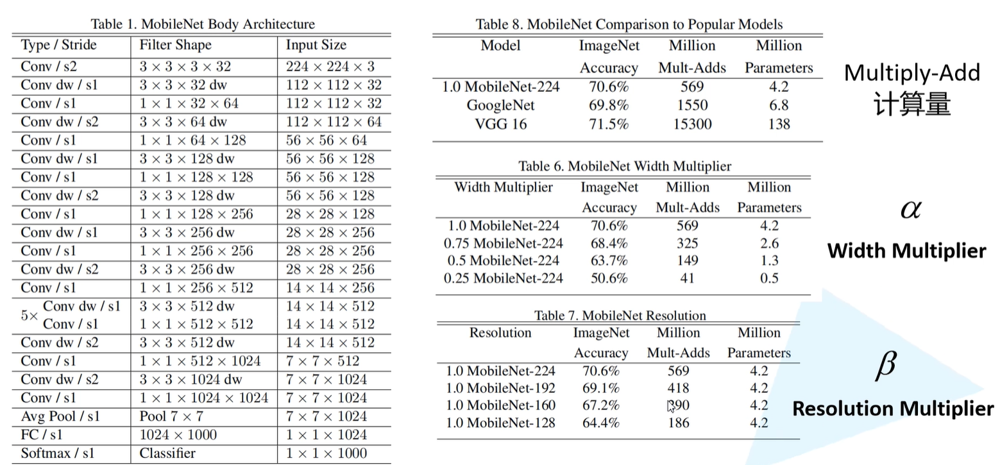
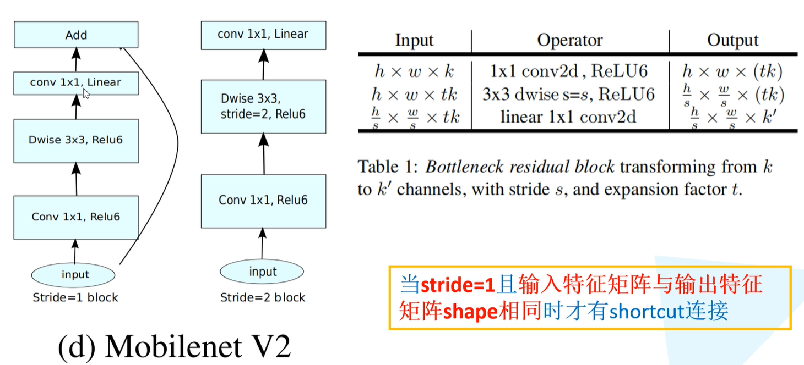
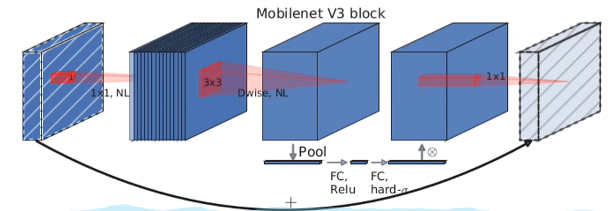

# MobileNet

> 主要介绍三个：v1，v2，v3。  MobileNet 系列主要还是利用DW卷积来进行一个轻量化模型的操作。

## DW卷积

- 传统卷积

    >卷积核的通道数是与输入特征矩阵的通道数相同的，并且输出特征矩阵的通道数等于卷积核的个数

    计算量：$D_K*D_K*M*N*D_F*D_F$

    >[!note] 计算量估算中，我们将输入特征的高宽设为$D_F$，输入特征的通道数设为N，卷积核的大小设为$D_k$，输出特征的通道数设为N，默认步距为1   一次卷积操作需要$D_K * D_K$次乘法操作

- DW卷积

    > 卷积核的通道数仅为1，每个卷积和与输入特征矩阵的一个通道进行卷积操作，所以输出特征矩阵的通道数不发生变化。

    计算量：$D_K*D_K*M*D_F*D_F$

- PW卷积

    > 在传统卷积的基础上要求卷积核的大小仅为1，将PW卷积核DW卷积组合可以构成深度可分的卷积（Depthwise Separable Conv）

    深度可分离卷积计算量：$D_K*D_K*M*D_F*D_F + M *N *D_F*D_F$

>[!tip] 将传统卷积和深度可分离卷积计算量做对比，传统卷积是后者的8-9倍计算量（卷积核越大，计算量减少的越多）

## V1

核心亮点：

- DWConv

- α和β超参数

结构和参数选择：

>[!note] DW卷积核很容废掉，也就是在训练过程中大多数DW卷积核的参数为0，所以在V2版本进行改进

## V2

核心亮点：

- Inverted Residuals

    > 原始的残差结构是中间小两头大， 该方法是中间大两头小。

    1. 对输入图像进行1*1卷积，并升维

    2. 对图像进行3*3的DW卷积操作，保持维度 (需要注意采用的是RELU6激活函数)

        > $y = ReLU6(x) = min(max(x, 0), 6)$

    3. 对图像进行1*1卷积，并降维

- Linear Bottlenecks 

    > 就是在Bottleneck的最后一层没有使用传统的ReLU非线性激活函数，而是使用Linear进行连接。

## V3

核心亮点：

- 更新的Bottleneck

    1. 加入了SE模块（注意力机制）

        > 对每个通道进行池化处理，得到一维的向量， 再通过两个全连接层（hidden_dim=1/4原始channel）得到输出的向量，将向量与原输入特征的各个通道相乘得到注意力后的特侦图。

    2. 更新了激活函数

    

- 使用NAS搜索参数

- 重新设计耗时层结构

>[!note] 后两个没必要说，NAS就是拼算力资源搜网络，重新设计就是挤牙膏不断尝试呗。