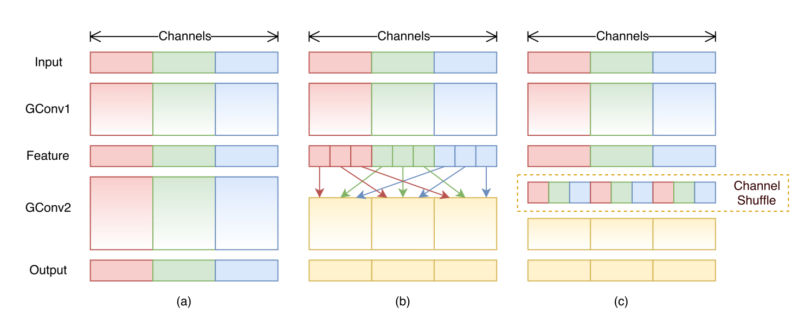
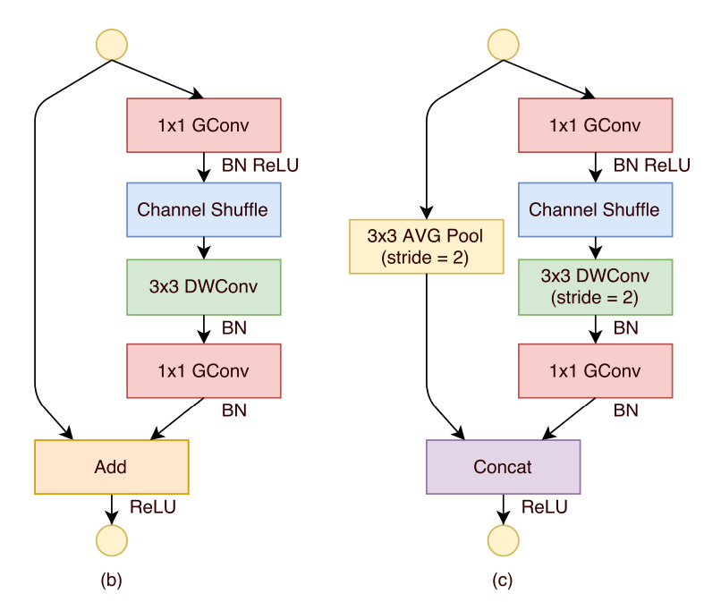
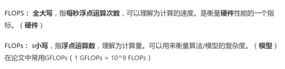
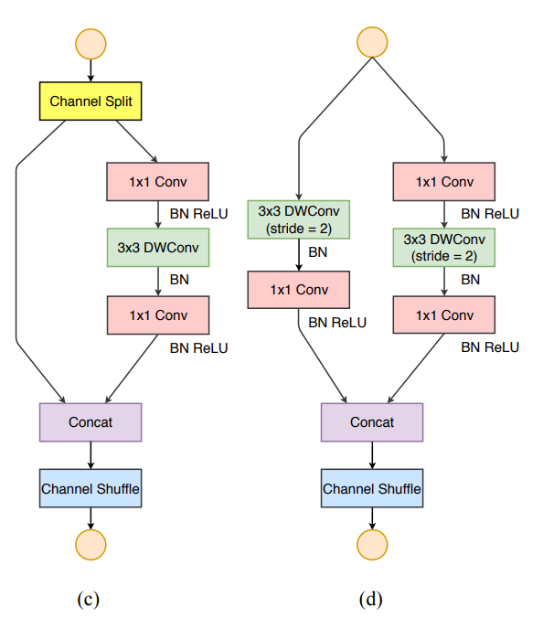

# ShuffleNet
 
 ## v1

 关键： 

 - 提出channel shuffle的思想

 - 所有的ShuffleNet Unit全是GConv和DWConv

 ### 创新

 普通的组卷积没有组件信息的交互，所以通过channel shuffle可以使得组之间交互

 

 由于ResNext网络当中主要的计算量都在于1\*1的卷积操作，所以本文将所有的1\*1普通卷积变成GConv

> 需要注意此时的捷径分支如果需要下采样的话不再使用1\*1的卷积，而是使用步长为2的3\*3平均池化层进行下采样。

## v2

> 需要注意就是FLOPs的含义：
>
>

v2论文提出：计算复杂度不能只看FLOPs，并提出4条设计高效网络准则，提出了新的block设计。

>[!tip] 对于网络的性能，FLOPs只是间接的表现了模型的复杂度，但是真实的计算量我们还是要依靠模型的推理速度(speed)来衡量快慢。同时我们还需要关注memory access cost(MAC，内存访问的时间成本)。除此之外还应该考虑并行等级，在相同的FLOPs的情况下，并行度高的模型比低的要快。同时还要注意部署平台上执行的消耗时间也不同。

四条高效设计的建议：

1. Equal channel width minimizes memory access cost(MAC)

    当卷积层的输入特征矩阵与输出特征矩阵的channel相等时MAC最小（保持FLOPs不变时）

    $MAC\geq2\sqrt{hwB}+\frac{B}{hw}\quad B=hwc_1c_2\quad\text{(FLOPs)}$

    > 注意这里说的主要是1×1的卷积层  $MAC=hw(c_1+c_2)+c_1c_2$   对于该公式的理解可以看成三部分：$hw×c_1$表示输入特征矩阵的内存消耗，$hw×c_2$表示输出特征矩阵的内存消耗，$c_1c_2$表示卷积核的内存消耗。

2. Excessive group convolution increases MAC

    当GConv的groups增大时（保持FLOPs不变时），MAC也会增大

3. Network fragmentation reduces degree of parallelism

    网络设计的碎片化程度越高，速度越慢（也就是网络的分支的多少和串联的个数多少）

4. Element_wise operation are non-negligible

    诸如ReLU，捷径分支，增加偏置等等一系列对数据元素的操作都会对网络的推理速度带来影响
    
    > 通常这些操作的FLOPs很小但是MAC很大。 

### 网络结构

> 需要注意三个卷积的输入和输出的通道数是相同的，满足G1要求；两个1×1的卷积不再使用组卷积，换回普通卷积，满足G2要求；残差连接使用Concat而不是使用add，满足G1要求；