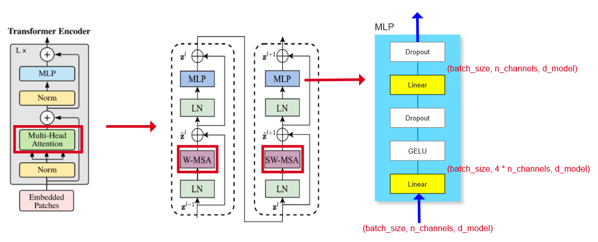

# Swin Transformer

## 网络架构


**SW-MSA**


**各种版本的swin配置**


## 代码实现
> 参考微软的开源代码（Swin-T）

### Patch Embedding

>[!note]
>虽然结构图上显示两个部分：Patch + PosEmbedding。 但是实际上和VIT思想一致，用一个卷积核大小和步长与patch_size相同的卷积操作实现两个操作。 

```python
class PatchEmbedding(nn.Module):
    '''和VIT的Embedding基本相同'''
    def __init__(self, img_size=224, patch_size=4, in_channels=3, d_model=96, norm_layer=None):
        '''
        :param img_size:
        :param patch_size:
        :param in_channels:
        :param d_model: 词嵌入的维度
        :param norm_layer: 是否在embedding后增加一个归一化操作（原论文中的配置图中提到使用了一层Layer Norm）
        '''
        self.img_size = (img_size, img_size)
        self.patch_size = (patch_size, patch_size)
        self.patches_resolution = (self.img_size[0] // self.patch_size[0], self.img_size[1] // self.patch_size[1])
        self.num_patches = self.patches_resolution[0] * self.patches_resolution[1]

        self.in_channels = in_channels
        self.d_model = d_model

        self.proj = nn.Conv2d(in_channels=in_channels, out_channels=d_model, kernel_size=patch_size, stride=patch_size)
        self.norm = norm_layer if norm_layer is not None else nn.LayerNorm(self.d_model)

    def forward(self, x):
        B, C, H, W = x.shape
        # 断言用来检查输入的图片特征是否和设定的图片高宽一致（简单实现不用这一行，只是大佬们模块化开发都会来这么一下检查输入
        assert H == self.img_size[0] and W == self.img_size[1], \
            f"Input image size ({H}*{W}) doesn't match model ({self.img_size[0]}*{self.img_size[1]})."
        # 和VIT的规则一致的，有疑问请回看VIT的PatchEmbedding部分
        x = self.proj(x).flatten(dim=2).transpose(1, 2)
        x = self.norm(x)
        return x
```

### Swin Transformer Block

>[!note]
>虽然在框架图里，我们把前一个Patch Merging和Swin Block作为一个stage，但是实际源码实现中将Swin Block和后一个Patch Merging作为一个stage。（我推测应该是应为结构图中第一个stage的Linear Embedding由于和Patch Partition合并了，所以都向后去划分）

对于单个Block，相比与 VIT Block，只是将 MSA 修改为 W-MSA 和 SW-MSA



```python
class SwinTransformerBlock(nn.Module):

    def __init__(self, input_resolution, d_model, num_heads, window_size=7, shift=0, norm_layer=nn.LayerNorm):
        self.input_resolution = input_resolution
        self.shift = shift
        self.window_size = window_size

        self.norm1 = norm_layer(d_model)
        self.attn = None

        self.norm2 = norm_layer(d_model)
        self.mlp = None

    def forward(self, x):
        # x: (8, 3136, 96)
        # input_resolution: (56, 56)
        H, W = self.input_resolution
        B, L, C = x.shape
        assert L == H * W, "input feature has wrong size"

        # shortcut: (8, 3136, 96)
        shortcut = x
        x = self.norm1(x)
        # x: (8, 56, 56, 96), 为什么又要拆开，因为后面要做W-MSA或者SW-MSA，需要对我们的输入特征图进行窗口划分，所以用二维更方便
        x = x.view(B, H, W, C)
        # 如果shift大于0则说明是SW-MSA，否则就是不太的W-MSA, 虽然论文中说先分割窗口再去移动，但是代码实现中先移动再分割更方便(直接使用torch.roll函数实现移动)
        if self.shift > 0:
            # shift_x: (8, 56, 56, 96)
            shift_x = torch.roll(x, (-self.shift, -self.shift), (1, 2))
        else:
            # W-MSA 不移动
            shift_x = x
        # 分割windows
        # x_windows: (8, 8, 8, 7, 7, 96)
        x_windows = window_partition(shift_x, self.window_size)
        # x: (512, 49, 96) 因为分好窗口后我们需要并行求每个窗口的attention，所以必须将维度变成(并行数, seq_len, d_model)
        x_windows = x_windows.view(-1, self.window_size * self.window_size, C)

        # attn_windows: (512, 49, 96)
        attn_windows = self.attn(x_windows, mask=self.attn_mask)

        # attn_windows: (512, 7, 7, 96)
        attn_windows = attn_windows.view(-1, self.window_size, self.window_size, C)
        # shift_x: (8, 56, 56, 96)
        shift_x = reverse_window(attn_windows, self.window_size, H, W)

        # 之前对特征图进行了移动，现在同样需要移动回去
        if self.shift > 0:
            x = torch.roll(shift_x, (self.shift, self.shift), (1, 2))
        else:
            x = shift_x

        # x: (8, 56, 56, 96) -> (8, 3136, 96)
        x = x.view(B, H * W, C)
        # 维度一致后进行残差链接
        x = x + shortcut

        # 第二部分比较简单写一行更爽
        x = x + self.mlp(self.norm2(x))
        return x


def window_partition(x, window_size=7):
    '''将特征图按照window_size进行分割'''
    # x: (8, 56, 56, 96)
    B, H, W, C = x.shape
    # x: (8, 8, 7, 8, 7, 96)
    x = x.view(B, H // window_size, window_size, W // window_size, window_size, C)
    # x: (8, 8, 8, 7, 7, 96) = (bs, H_num_of_windows, W_num_of_windows, window_size_h, window_size_w, d_model)
    x = x.permute(0, 1, 3, 2, 4, 5)
    return x

def reverse_window(attn_windows, window_size, H, W):
    '''实际就是window_partition的你操作，还原回 (8, 56, 56, 96)'''
    # attn_windows: (512, 7, 7, 96)
    B = attn_windows.shape[0] / (H // window_size * W // window_size)
    # x: (8, 8, 8, 7, 7, 96)
    x = attn_windows.view(B, H // window_size, W // window_size, window_size, window_size, -1)
    # x: (8, 56, 56, 96)
    # 为什么要调用contiguous，因为view操作必须要求我们的tensor数据在内存中连续存放，而permute以及transpose之后，由于转置导致数据存放非连续，
    # 所以必须调用contiguous使得内存数据连续存储再调用view操作
    x = x.permute(0, 1, 3, 2, 4, 5).contiguous().view(B, H, W, -1)
    return x

```

>[!tip]torch.roll( )：
>官方文档的说明：沿着给定的维度**滚动**tensor，在第一个位置处，重新引入超过最后一个位置的元素。
>
>三个参数:
>
>1. input: 输入的tensor 
>2. shifts: 可以是int，也可以是int型的元组。（就是滚动的步数，如果是元组，输入维度必须和元组的size相同，每个维度按照对应的步数滚动）
>3. dim： roll的维度
>
> 举例：
>```
> x = torch.from_numpy(np.array([[1,2,3],[4,5,6],[7,8,9]]))
> x = torch.roll(x, (1, 1), (0, 1))
> print(x)
> # [[9,7,8],[3,1,2],[6,4,5]] 
>``` 