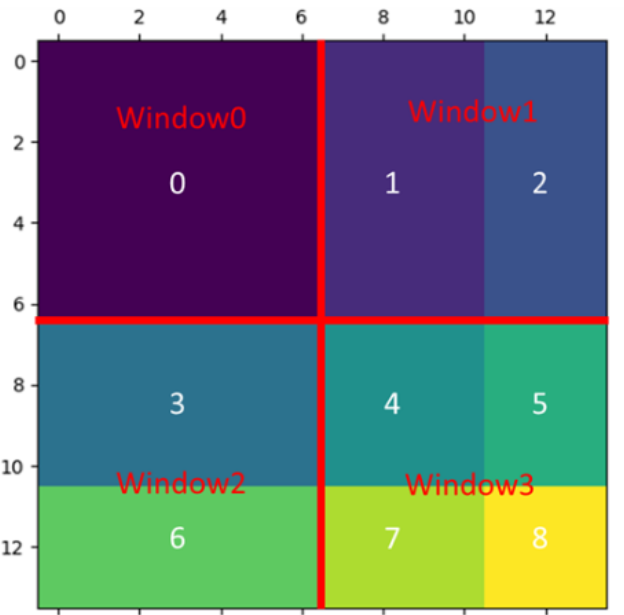
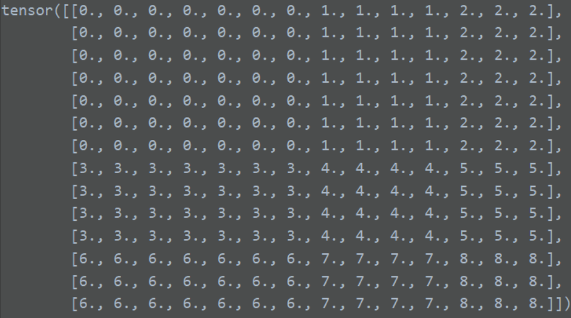
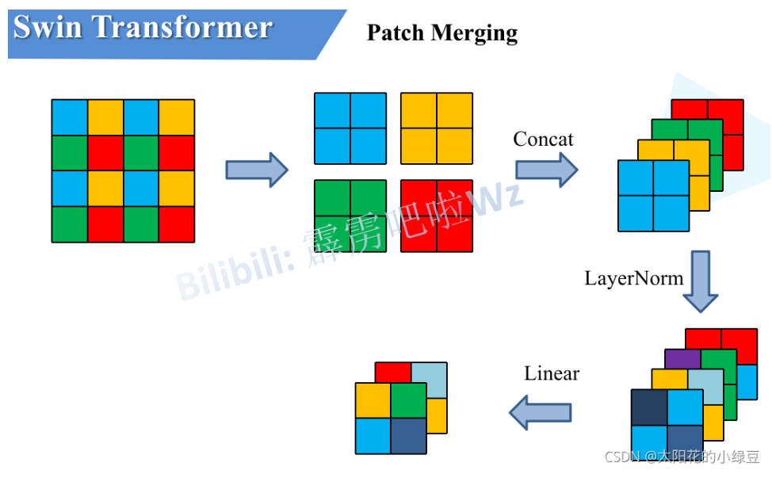

# Swin Transformer

## 网络架构


**SW-MSA**


**各种版本的swin配置**


## 代码实现
> 参考微软的开源代码（Swin-T）

### Patch Embedding

>[!note]
>虽然结构图上显示两个部分：Patch + PosEmbedding。 但是实际上和VIT思想一致，用一个卷积核大小和步长与patch_size相同的卷积操作实现两个操作。 

```python
class PatchEmbedding(nn.Module):
    '''和VIT的Embedding基本相同'''
    def __init__(self, img_size=224, patch_size=4, in_channels=3, d_model=96, norm_layer=None):
        '''
        :param img_size:
        :param patch_size:
        :param in_channels:
        :param d_model: 词嵌入的维度
        :param norm_layer: 是否在embedding后增加一个归一化操作（原论文中的配置图中提到使用了一层Layer Norm）
        '''
        super(PatchEmbedding, self).__init__()
        self.img_size = (img_size, img_size)
        self.patch_size = (patch_size, patch_size)
        self.patches_resolution = (self.img_size[0] // self.patch_size[0], self.img_size[1] // self.patch_size[1])
        self.num_patches = self.patches_resolution[0] * self.patches_resolution[1]

        self.in_channels = in_channels
        self.d_model = d_model

        self.proj = nn.Conv2d(in_channels=in_channels, out_channels=d_model, kernel_size=patch_size, stride=patch_size)
        self.norm = norm_layer(d_model) if norm_layer is not None else nn.LayerNorm(self.d_model)

    def forward(self, x):
        # x: (8, 3, 224, 224)
        B, C, H, W = x.shape
        # 断言用来检查输入的图片特征是否和设定的图片高宽一致（简单实现不用这一行，只是大佬们模块化开发都会来这么一下检查输入
        assert H == self.img_size[0] and W == self.img_size[1], \
            f"Input image size ({H}*{W}) doesn't match model ({self.img_size[0]}*{self.img_size[1]})."
        # 和VIT的规则一致的，有疑问请回看VIT的PatchEmbedding部分
        # x: (8, 3, 224, 224) -> (8, 96, 56, 56) -> (8, 96, 3136) -> (8, 3136, 96)
        x = self.proj(x).flatten(2).transpose(1, 2)
        x = self.norm(x)
        return x
```

### Swin Transformer Block

>[!note]
>虽然在框架图里，我们把前一个Patch Merging和Swin Block作为一个stage，但是实际源码实现中将Swin Block和后一个Patch Merging作为一个stage。（我推测应该是应为结构图中第一个stage的Linear Embedding由于和Patch Partition合并了，所以都向后去划分）

对于单个Block，相比与 VIT Block，只是将 MSA 修改为 W-MSA 和 SW-MSA


```python
class SwinTransformerBlock(nn.Module):

    def __init__(self, input_resolution, d_model, num_heads, window_size=7, shift=0, norm_layer=nn.LayerNorm, mlp_ratio=4):
        super(SwinTransformerBlock, self).__init__()
        self.input_resolution = input_resolution
        self.shift = shift
        self.window_size = window_size
        self.mlp_ratio = mlp_ratio
        self.d_model = d_model
        self.num_heads = num_heads

        self.norm1 = norm_layer(d_model)
        self.attn = WindowAttention(d_model, window_size=(self.window_size, self.window_size), num_heads=num_heads)

        self.norm2 = norm_layer(d_model)
        mlp_hidden_dim = int(d_model * self.mlp_ratio)
        self.mlp = MLP(in_channels=d_model, hidden_channels=mlp_hidden_dim)

        # 如果shift不为0，则说明是移动窗口注意力，需要生成mask
        if self.shift > 0:
            # 计算生成合适的mask
            H, W = self.input_resolution
            img_mask = torch.zeros((1, H, W, 1))
            h_slices = (slice(0, -self.window_size),
                        slice(-self.window_size, -self.shift),
                        slice(-self.shift, None))
            w_slices = (slice(0, -self.window_size),
                        slice(-self.window_size, -self.shift),
                        slice(-self.shift, None))
            cnt = 0
            for h in h_slices:
                for w in w_slices:
                    img_mask[:, h, w, :] = cnt
                    cnt += 1
            # mask_windows: (64, 7, 7, 1)
            mask_windows = window_partition(img_mask, self.window_size)  # nW, window_size, window_size, 1
            mask_windows = mask_windows.view(-1, self.window_size * self.window_size)  # (64, 96)
            attn_mask = mask_windows.unsqueeze(1) - mask_windows.unsqueeze(2)  # (64, 49, 49)
            attn_mask = attn_mask.masked_fill(attn_mask != 0, float(-100.0)).masked_fill(attn_mask == 0, float(0.0))
        else:
            attn_mask = None

        self.register_buffer("attn_mask", attn_mask)

    def forward(self, x):
        # x: (8, 3136, 96)
        # input_resolution: (56, 56)
        H, W = self.input_resolution
        B, L, C = x.shape
        assert L == H * W, "input feature has wrong size"

        # shortcut: (8, 3136, 96)
        shortcut = x
        x = self.norm1(x)
        # x: (8, 56, 56, 96), 为什么又要拆开，因为后面要做W-MSA或者SW-MSA，需要对我们的输入特征图进行窗口划分，所以用二维更方便
        x = x.view(B, H, W, C)
        # 如果shift大于0则说明是SW-MSA，否则就是不太的W-MSA, 虽然论文中说先分割窗口再去移动，但是代码实现中先移动再分割更方便(直接使用torch.roll函数实现移动)
        if self.shift > 0:
            # shift_x: (8, 56, 56, 96)
            shift_x = torch.roll(x, (-self.shift, -self.shift), (1, 2))
        else:
            # W-MSA 不移动
            shift_x = x
        # 分割windows
        # x_windows: (8, 8, 8, 7, 7, 96)
        x_windows = window_partition(shift_x, self.window_size)
        x_windows = x_windows.view(-1, self.window_size * self.window_size, C)  # (512, 49, 96)

        # attn_windows: (512, 49, 96)
        attn_windows = self.attn(x_windows, mask=self.attn_mask)

        # attn_windows: (512, 7, 7, 96)
        attn_windows = attn_windows.view(-1, self.window_size, self.window_size, C)
        # shift_x: (8, 56, 56, 96)
        shift_x = reverse_window(attn_windows, self.window_size, H, W)

        # 之前对特征图进行了移动，现在同样需要移动回去
        if self.shift > 0:
            x = torch.roll(shift_x, (self.shift, self.shift), (1, 2))
        else:
            x = shift_x

        # x: (8, 56, 56, 96) -> (8, 3136, 96)
        x = x.view(B, H * W, C)
        # 维度一致后进行残差链接
        x = x + shortcut

        # 第二部分比较简单写一行更爽
        x = x + self.mlp(self.norm2(x))  # (8, 3136, 96)
        return x


def window_partition(x, window_size=7):
    '''将特征图按照window_size进行分割'''
    # x: (8, 56, 56, 96)
    B, H, W, C = x.shape
    # x: (8, 8, 7, 8, 7, 96)
    x = x.view(B, H // window_size, window_size, W // window_size, window_size, C)
    # x: (8, 8, 8, 7, 7, 96) = (bs, H_num_of_windows, W_num_of_windows, window_size_h, window_size_w, d_model)
    x = x.permute(0, 1, 3, 2, 4, 5).contiguous().view(-1, window_size, window_size, C)
    # x: (512, 49, 96) 因为分好窗口后我们需要并行求每个窗口的attention，所以必须将维度变成(并行数, seq_len, d_model)
    return x

def reverse_window(attn_windows, window_size, H, W):
    '''实际就是window_partition的你操作，还原回 (8, 56, 56, 96)'''
    # attn_windows: (512, 7, 7, 96)
    B = int(attn_windows.shape[0] / (H // window_size * W // window_size))
    # x: (8, 8, 8, 7, 7, 96)
    x = attn_windows.view(B, H // window_size, W // window_size, window_size, window_size, -1)
    # x: (8, 56, 56, 96)
    # 为什么要调用contiguous，因为view操作必须要求我们的tensor数据在内存中连续存放，而permute以及transpose之后，由于转置导致数据存放非连续，
    # 所以必须调用contiguous使得内存数据连续存储再调用view操作
    x = x.permute(0, 1, 3, 2, 4, 5).contiguous().view(B, H, W, -1)
    return x

class MLP(nn.Module):

    def __init__(self, in_channels, out_channels = None, hidden_channels = None, act_layer=nn.GELU, drop=0.):
        super(MLP, self).__init__()
        out_channels = in_channels if out_channels is None else out_channels
        hidden_channels = hidden_channels or in_channels
        self.fc1 = nn.Linear(in_channels, hidden_channels)
        self.act = act_layer()
        self.fc2 = nn.Linear(hidden_channels, out_channels)
        self.drop = nn.Dropout(drop)

    def forward(self, x):
        x = self.fc1(x)
        x = self.act(x)
        x = self.drop(x)
        x = self.fc2(x)
        x = self.drop(x)
        return x

```

>[!tip]torch.roll( )：
>官方文档的说明：沿着给定的维度**滚动**tensor，在第一个位置处，重新引入超过最后一个位置的元素。
>
>三个参数:
>
>1. input: 输入的tensor 
>2. shifts: 可以是int，也可以是int型的元组。（就是滚动的步数，如果是元组，输入维度必须和元组的size相同，每个维度按照对应的步数滚动）
>3. dim： roll的维度
>
> 举例：
>```
> x = torch.from_numpy(np.array([[1,2,3],[4,5,6],[7,8,9]]))
> x = torch.roll(x, (1, 1), (0, 1))
> print(x)
> # [[9,7,8],[3,1,2],[6,4,5]] 
>``` 

#### W-MSA AND SW-MSA

> 仅提供代码，进行回顾学习; 理论回顾可以参考原作者的github回答：https://github.com/microsoft/Swin-Transformer/issues/38
```python
class SwinTransformerBlock(nn.Module):

    def __init__(self, input_resolution, d_model, num_heads, window_size=7, shift=0, norm_layer=nn.LayerNorm, mlp_ratio=4):
        super(SwinTransformerBlock, self).__init__()
        self.input_resolution = input_resolution
        self.shift = shift
        self.window_size = window_size
        self.mlp_ratio = mlp_ratio
        self.d_model = d_model
        self.num_heads = num_heads

        self.norm1 = norm_layer(d_model)
        self.attn = WindowAttention(d_model, window_size=(self.window_size, self.window_size), num_heads=num_heads)

        self.norm2 = norm_layer(d_model)
        mlp_hidden_dim = int(d_model * self.mlp_ratio)
        self.mlp = MLP(in_channels=d_model, hidden_channels=mlp_hidden_dim)

        # 如果shift不为0，则说明是移动窗口注意力，需要生成mask
        if self.shift > 0:
            # 计算生成合适的mask
            H, W = self.input_resolution
            # img_mask 的维度设置主要是对应我们输入图片的维度(bs, H, W, C), 可以理解为生成一个和图片大小相同的mask
            img_mask = torch.zeros((1, H, W, 1))
            h_slices = (slice(0, -self.window_size),
                        slice(-self.window_size, -self.shift),
                        slice(-self.shift, None))
            w_slices = (slice(0, -self.window_size),
                        slice(-self.window_size, -self.shift),
                        slice(-self.shift, None))
            # 编号
            cnt = 0
            # for循环实际就是遍历移动后的各个区域，需要对每个区域内的不同块进行不同的编号
            for h in h_slices:
                for w in w_slices:
                    img_mask[:, h, w, :] = cnt
                    cnt += 1
            # mask_windows: (64, 7, 7, 1)
            mask_windows = window_partition(img_mask, self.window_size)
            # mask_windows: (64, 49)
            mask_windows = mask_windows.view(-1, self.window_size * self.window_size)
            # attn_mask: (64, 49, 49), 相减就是判断每个window里哪个几个对应是相同的，需要做注意力，也就是为了下一步的填充做准备
            attn_mask = mask_windows.unsqueeze(1) - mask_windows.unsqueeze(2)
            # attn_mask: (64, 49, 49), 只要哪个位置不等于0，说明不需要做注意力，为其填充-100，在softmax后基本归零
            attn_mask = attn_mask.masked_fill(attn_mask != 0, float(-100.0)).masked_fill(attn_mask == 0, float(0.0))  
        else:
            attn_mask = None

        self.register_buffer("attn_mask", attn_mask)

    def forward(self, x):
        # x: (8, 3136, 96)
        # input_resolution: (56, 56)
        H, W = self.input_resolution
        B, L, C = x.shape
        assert L == H * W, "input feature has wrong size"

        # shortcut: (8, 3136, 96)
        shortcut = x
        x = self.norm1(x)
        # x: (8, 56, 56, 96), 为什么又要拆开，因为后面要做W-MSA或者SW-MSA，需要对我们的输入特征图进行窗口划分，所以用二维更方便
        x = x.view(B, H, W, C)
        # 如果shift大于0则说明是SW-MSA，否则就是不太的W-MSA, 虽然论文中说先分割窗口再去移动，但是代码实现中先移动再分割更方便(直接使用torch.roll函数实现移动)
        if self.shift > 0:
            # shift_x: (8, 56, 56, 96)
            shift_x = torch.roll(x, (-self.shift, -self.shift), (1, 2))
        else:
            # W-MSA 不移动
            shift_x = x
        # 分割windows
        # x_windows: (8, 8, 8, 7, 7, 96)
        x_windows = window_partition(shift_x, self.window_size)
        x_windows = x_windows.view(-1, self.window_size * self.window_size, C)  # (512, 49, 96)

        # attn_windows: (512, 49, 96)
        attn_windows = self.attn(x_windows, mask=self.attn_mask)

        # attn_windows: (512, 7, 7, 96)
        attn_windows = attn_windows.view(-1, self.window_size, self.window_size, C)
        # shift_x: (8, 56, 56, 96)
        shift_x = reverse_window(attn_windows, self.window_size, H, W)

        # 之前对特征图进行了移动，现在同样需要移动回去
        if self.shift > 0:
            x = torch.roll(shift_x, (self.shift, self.shift), (1, 2))
        else:
            x = shift_x

        # x: (8, 56, 56, 96) -> (8, 3136, 96)
        x = x.view(B, H * W, C)
        # 维度一致后进行残差链接
        x = x + shortcut

        # 第二部分比较简单写一行更爽
        x = x + self.mlp(self.norm2(x))  # (8, 3136, 96)
        return x
```
>[!note] 其中这一步部分逻辑可能直接看上去有点疑惑：
>```python
>h_slices = (slice(0, -self.window_size),
>                        slice(-self.window_size, -self.shift),
>                        slice(-self.shift, None))
>            w_slices = (slice(0, -self.window_size),
>                        slice(-self.window_size, -self.shift),
>                        slice(-self.shift, None))
>            # 编号
>            cnt = 0
>            # for循环实际就是遍历移动后的各个区域，需要对每个区域内的不同块进行不同的编号
>            for h in h_slices:
>                for w in w_slices:
>                    img_mask[:, h, w, :] = cnt
>                    cnt += 1
>```
>但是你看下面这两个图应该就清楚了：<br>
>
>
> 为什么是高宽都是三个切片，因为移动后需要掩码的实际就只有3*3，9个不同的掩码区域。

### Patch Merging
> 原理一图可以看懂，参照霹雳吧啦Wz
> 

```python
class PatchMerging(nn.Module):

    def __init__(self, input_resolution, dim, norm_layer=nn.LayerNorm):
        super().__init__()
        self.input_resolution = input_resolution
        self.dim = dim
        self.reduction = nn.Linear(4 * dim, 2 * dim, bias=False)
        self.norm = norm_layer(4 * dim)

    def forward(self, x):
        """
        x: B, H*W, C
        """
        H, W = self.input_resolution
        B, L, C = x.shape
        assert L == H * W, "input feature has wrong size"
        assert H % 2 == 0 and W % 2 == 0, f"x size ({H}*{W}) are not even."

        x = x.view(B, H, W, C)

        x0 = x[:, 0::2, 0::2, :]  # [B, H/2, W/2, C]
        x1 = x[:, 1::2, 0::2, :]  # [B, H/2, W/2, C]
        x2 = x[:, 0::2, 1::2, :]  # [B, H/2, W/2, C]
        x3 = x[:, 1::2, 1::2, :]  # [B, H/2, W/2, C]
        x = torch.cat([x0, x1, x2, x3], -1)  # [B, H/2, W/2, 4*C]
        x = x.view(B, -1, 4 * C)  # [B, H/2*W/2, 4*C]
        x = self.norm(x)
        x = self.reduction(x)  # [B, H/2*W/2, 2*C]

        return x
```

### Swin T
>[!tip]现在只需要讲上述所有模块都按照Swin Transformer的架构图整合起来即可。以下仅实现Swin-T架构。
```python
class BasicLayer(nn.Module):
    '''搭建layer'''
    def __init__(self, d_model, input_resolution, depth, num_heads, window_size, mlp_ratio, norm_layer=nn.LayerNorm, downsample=None, use_checkpoint=False):
        super(BasicLayer, self).__init__()
        self.dim = d_model
        self.input_resolution = input_resolution
        self.depth = depth
        self.use_checkpoint = use_checkpoint

        # build blocks
        self.blocks = nn.ModuleList([
            SwinTransformerBlock(
                d_model=d_model,
                input_resolution=input_resolution,
                num_heads=num_heads,
                window_size=window_size,
                shift=0 if (i % 2 == 0) else window_size // 2,
                mlp_ratio=mlp_ratio,
                norm_layer=norm_layer)
            for i in range(depth)])

        # patch merging layer
        if downsample is not None:
            self.downsample = downsample(input_resolution, dim=d_model, norm_layer=norm_layer)
        else:
            self.downsample = None

    def forward(self, x):
        for blk in self.blocks:
            if self.use_checkpoint:
                x = checkpoint.checkpoint(blk, x)
            else:
                x = blk(x)
        if self.downsample is not None:
            x = self.downsample(x)
        return x
```

```python
class SwinTransformer(nn.Module):
    '''汇总所有的模块'''
    def __init__(self, img_size=224, patch_size=4, in_chans=3, num_classes=1000,
                 embed_dim=96, depths=(2, 2, 6, 2), num_heads=(3, 6, 12, 24),
                 window_size=7, mlp_ratio=4., qkv_bias=True,
                 drop_rate=0., attn_drop_rate=0., drop_path_rate=0.1,
                 norm_layer=nn.LayerNorm, patch_norm=True,
                 use_checkpoint=False, **kwargs):
        super().__init__()

        self.num_classes = num_classes
        self.num_layers = len(depths)
        self.embed_dim = embed_dim
        self.patch_norm = patch_norm

        self.num_features = int(embed_dim * 2 ** (self.num_layers - 1))
        self.mlp_ratio = mlp_ratio

        # split image into non-overlapping patches
        self.patch_embed = PatchEmbedding(img_size=img_size, patch_size=patch_size, in_channels=in_chans, d_model=embed_dim,
                                      norm_layer=norm_layer if self.patch_norm else None)

        self.patches_resolution = self.patch_embed.patches_resolution
        self.pos_drop = nn.Dropout(p=drop_rate)

        # stochastic depth 用于drop path
        dpr = [x.item() for x in torch.linspace(0, drop_path_rate, sum(depths))]  # stochastic depth decay rule

        # build layers
        self.layers = nn.ModuleList()
        for i_layer in range(self.num_layers):
            layers = BasicLayer(d_model=int(embed_dim * 2 ** i_layer),
                                input_resolution=(self.patches_resolution[0] // (2 ** i_layer),
                                                  self.patches_resolution[1] // (2 ** i_layer)),
                                depth=depths[i_layer],
                                num_heads=num_heads[i_layer],
                                window_size=window_size,
                                mlp_ratio=self.mlp_ratio,
                                norm_layer=norm_layer,
                                downsample=PatchMerging if (i_layer < self.num_layers - 1) else None,
                                use_checkpoint=use_checkpoint)
            self.layers.append(layers)

        self.norm = norm_layer(self.num_features)
        self.avgpool = nn.AdaptiveAvgPool1d(1)
        self.head = nn.Linear(self.num_features, num_classes) if num_classes > 0 else nn.Identity()

        self.apply(self._init_weights)

    def _init_weights(self, m):
        if isinstance(m, nn.Linear):
            nn.init.trunc_normal_(m.weight, std=.02)
            if isinstance(m, nn.Linear) and m.bias is not None:
                nn.init.constant_(m.bias, 0)
        elif isinstance(m, nn.LayerNorm):
            nn.init.constant_(m.bias, 0)
            nn.init.constant_(m.weight, 1.0)

    def forward(self, x):
        x = self.patch_embed(x)
        x = self.pos_drop(x)

        for layer in self.layers:
            x = layer(x)

        x = self.norm(x)  # [B, L, C]
        x = self.avgpool(x.transpose(1, 2))  # [B, C, 1]
        x = torch.flatten(x, 1)
        x = self.head(x)
        return x
```

```python
def swin_tiny_patch4_window7_224(num_classes: int = 1000, **kwargs):
    # trained ImageNet-1K
    # https://github.com/SwinTransformer/storage/releases/download/v1.0.0/swin_tiny_patch4_window7_224.pth
    model = SwinTransformer(img_size=224,
                            in_chans=3,
                            patch_size=4,
                            window_size=7,
                            embed_dim=96,
                            depths=(2, 2, 6, 2),
                            num_heads=(3, 6, 12, 24),
                            num_classes=num_classes,
                            **kwargs)
    return model
```

>[!warning]最后利用torchinfo测得参数量：
> Total params: 28,265,032； 与原论文的29M接近
> 但是与torchsummary测得的参数量有很大的差异，不知道为什么