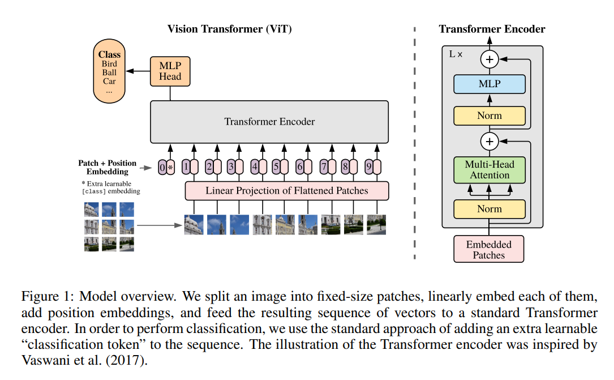

# Vision Transformer

## 网络架构图




## 实现代码

### Patch Embedding

Patch Embedding 的目的就是将图中的一个完整的图片分割成多个Patch_size * Patch_size 高宽的小图块，同时为了借助Transformer的设计，我们需要将每个Patch(小图块) 拉直输入到一个线性映射成，将我们的图片输入映射成一个个embedding(NLP叫词嵌入)。
> 看起来实现Patch Embedding需要两个步骤：1. 把图片风格成多个相同大小的Patch；2. 把一个一个Patch排好序列输入到一个映射层。
> 
> 实际可以用一个卷积核大小和步长都等于Patch Size大小的卷积来取代上述两步操作。（每对图像的一个卷积核区域做卷积操作的时候，就相当于同时进行了切分和映射的过程）

```python
class PatchEmbedding(nn.Module):
    '''实现图片的切分并转换成词嵌入向量'''
    def __init__(self, img_size, patch_size, d_model, in_channels, norm=None):
        '''
        :param img_size:
        :param patch_size: 每个小图块的高或宽(高宽等同)
        :param d_model: 每个patch在经过映射层之后词嵌入的维度
        :param in_channels: 输入图像的通道数
        :param norm: 将图片映射后是否需要进行归一化操作
        '''
        super(PatchEmbedding, self).__init__()
        # 暂存一下图片和Patch的大小（感觉实际没什么用处，但是参照大佬的写法普遍暂存了）
        img_size = (img_size, img_size)
        patch_size = (patch_size, patch_size)
        self.img_size = img_size
        self.patch_size = patch_size
        # 记录分割后图变成了几行几列的分割块矩阵
        self.grid_size = (img_size[0] // patch_size[0], img_size[1] // patch_size[1])
        # 记录一共分割出了多少个Patches
        self.num_patches = self.grid_size[0] * self.grid_size[1]

        # 用卷积代替split_patch(只要使得步长和patch大小相同就可以实现分割，并同时进行映射)
        self.conv = nn.Conv2d(in_channels, d_model, kernel_size=patch_size, stride=patch_size)
        # 如果没有传入norm，那么调用nn.Identity() 就如同 f(x) = x，等值映射
        self.norm = norm(d_model) if norm else nn.Identity()

    def forward(self, x):
        # 以 (1, 3, 224, 224) 为例
        bs, c, h, w = x.shape
        # x: (1, 3, 224, 224) -> (1, 768, 14, 14)
        # patch_size = 16 所以 224 / 16 = 14, 总共有14*14个patch
        x = self.conv(x)
        # flatten(n) 函数的作用是可以将多维的数据进行降维处理，他会保存前n维的维度，后面的所有维度会堆叠在第n维上
        # 为什么要在第n维堆叠，因为映射后的输出实际是还是一个14 * 14的二维数据，
        # 但是后续做attention运算时，我们需要模仿NLP以一个序列的形式输入，所以需要把二维拉直成一维
        # transpose(n,m) 函数的作用是将数据的第n维和第m维交换（转置），因为我们实际是对每个embedding做自注意力运算，并且想要并行计算所有的patches的自注意力结果，所以需要交换我们的 h*w 和 c
        # 更形象的来说，只有这样，在后续做矩阵乘法的时候，才可以实现(1, 196, 769) @ (1, 196, 768).T 得到 (1, 196, 196)，也就是相当于拿到了196个patches的自注意力图。（可以参考李沐的attention并行化过程）
        # (bs, c, h, w) -> (bs, c, h*w) -> (bs, h*w, c)；
        # (1, 768, 14, 14) -> (1, 768, 196) -> (1, 196, 768)
        x = x.flatten(2).transpose(1, 2)
        # 基本上不会传入norm，所以这里实际没操作，就是等值映射
        x = self.norm(x)
        return x
```