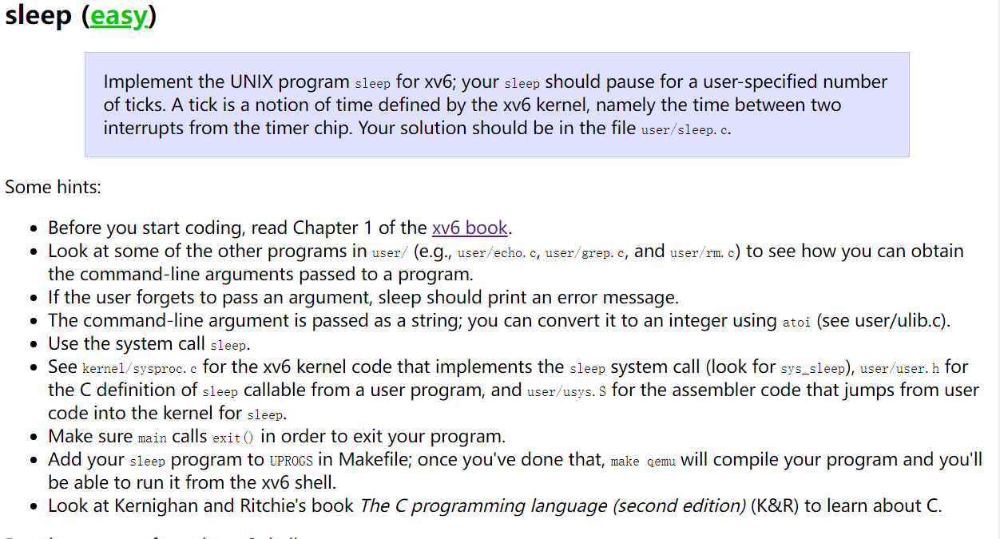

# Lab 1 - Utils

## sleep

>[!tip]
>
>
>核心是实现一个sleep命令，唯一参数是睡眠时间

由于不管是Linux还是qemu模拟的x86都已经提供了sleep系统调用，所以直接调用即可。

```c
#include "kernel/types.h"
#include "user/user.h"

int main(int argc, char* argv[]) {
    if (argc != 2) {
        fprintf(2, "ERROR: sleep time required!");
        exit(1);
    } 
    // 使用标准linux系统调用直接实现, atoi() 讲字符串转整数
    sleep(atoi(argv[1]));    
    exit(0);
}
```

## pingpong

>[!tip]
>
>
> 实现父子进程之间的简单通信， 父进程收到信息后打印ping，子进程收到信息后打印pong

实现父子进程通信最常用的就是结合pipe管道文件和fork系统调用 <br> 因为fork在创建子进程时是full copy，包括了文件描述符，所以对应的pipe自然会被复制过去。<br> 但还是需要注意的就是进程通信之间的先后关系，父进程通常需要等待子进程的结束。

>[!note]
> 管道是半双工通信，所以实际上想要实现父子进程通信，实际上需要创建两个管道文件！
>数据只能单向移动的意思是FIFO，于是linux中实际构建了一个循环队列。具体一点则是，申请一个缓冲区，作为 pipe() 操作中匿名管道文件实体，缓冲区设俩指针，一个读指针，一个写指针，并保证读指针向前移动不能超过写指针，否则唤醒写进程并睡眠，直到读满需要的字节数。同理写指针向前也不能超过读指针，否则唤醒读进程并睡眠，直到写满要求的字节数。

```c
#include "kernel/types.h"
#include "user/user.h"

int main(int argc, char *argv[]) {
    if (argc != 1) {
        fprintf(2, "ERROR: pingpong has no paramters!");
        exit(1);
    }
    int p2c[2], c2p[2];
    pipe(p2c);
    pipe(c2p);
    if (fork() == 0) {
        char buf;
        read(p2c[0], &buf, 1);
        close(p2c[0]);
        printf("%d: received ping\n", getpid());
        write(c2p[1], &buf, 1);
        close(c2p[1]);
    } else {
        write(p2c[1], "!", 1);
        close(p2c[1]);
        char buf;
        wait(0);
        read(c2p[0], &buf, 1);
        printf("%d: received pong\n", getpid());
        close(c2p[0]);
    } 
    exit(0);
}
```

## primes

>[!tip]
>
> 
> 实现创建多个子进程计算素数。（原理是埃式筛法）<br> 

基于图中素数筛的流程，primes的实现显然基于递归，递归创建子进程，并通过pipe读取父进程传递的仍在筛中的数。

>[note] 非常重要的一点就是文件描述符是有限的，如果pipe的读写端不及时关闭，很可能在多次递归后造成没有空余的文件描述符可以使用。

```c
#include "kernel/types.h"
#include "user/user.h"

void solve(int *pleft) {
   int p;
   close(pleft[1]); // 子进程关闭写端，此时不需要写，只需要从管道中读
   read(pleft[0], &p, sizeof(p)); 
   if (p == -1) {
        exit(0);
   } 
   printf("prime %d\n", p);
   int pright[2];
   pipe(pright);
   if (fork() == 0) {
        solve(pright);  // 递归筛素数
   } else {
        close(pright[0]);   // 关闭右侧的写端，此时作为父进程只需要写
        int prime = p;
        while(read(pleft[0], &p, sizeof(p)) != 0) {
            if (p % prime != 0) {
                write(pright[1], &p, sizeof(p));
            }
        }
        close(pright[1]);
        close(pleft[0]);
        wait(0);
   }
   exit(0);
}

int main(int argc, char *argv[]) {
    if (argc != 1) {
        fprintf(2, "ERROR: primes has no paramters!\n");
        exit(1);
    }
    int p1[2];
    pipe(p1);
    if (fork() == 0) {
        solve(p1);
        exit(0);
    } else { 
        close(p1[0]);   // 父进程先关闭读端，因为不需要读。
        int i;
        for (i = 2; i <= 35; i ++) {
            write(p1[1], &i, sizeof(i));
        }
        i = -1;
        write(p1[1], &i, sizeof(i));    // 将-1写入管道，用于表示筛完退出
        close(p1[1]);   // 写结束，关闭写端
        wait(0);
    }
    exit(0);
}
```

## find

>[!tip]
>
>
>实现 find 命令，查找该目录下所有为指定名字的文件。并且输出该文件的绝对路径。(和ls很像)

```c
#include "kernel/types.h"
#include "kernel/stat.h"
#include "kernel/fs.h"
#include "user/user.h"

void find(char *path, char *template) {
    int fd;
    struct dirent de;
    struct stat st;
    char buf[512], *p;

    if ((fd = open(path, 0)) < 0) {
        fprintf(2, "find: cannot open %s\n", path);
        return;
    }

    if (fstat(fd, &st) < 0) {
        fprintf(2, "find: cannot stat %s\n", path);
        close(fd);
        return;
    } 

    while (read(fd, &de, sizeof(de)) == sizeof(de)) {
        strcpy(buf, path);
        p = buf + strlen(buf);
        *p++ ='/';
        if (de.inum == 0)
            continue;
        memmove(p, de.name, DIRSIZ);
        // p[DIRSIZ] = 0;
        if(stat(buf, &st) < 0) {
            fprintf(2, "find: cannot stat %s\n", path);
            continue;
        }
        switch(st.type) {
            case T_FILE:
                if (strcmp(template, de.name) == 0) {
                    printf("%s\n", buf);
                }
                break;
            case T_DIR:
                if ((strcmp(de.name, ".") != 0) && (strcmp(de.name, "..") != 0)) {
                    find(buf, template);    // 本质是一个dfs
                }
        }   
    }
    close(fd);
    return;
}

int main(int argc, char *argv[]) {
    if (argc != 3) {
        fprintf(2, "ERROR: find required path and template!\n");
        exit(1);
    }
    char *path = argv[1];
    char *template = argv[2];
    find(path, template);
    exit(0);
}
```

>[!note] 在linux中其实可以更简单的用opendir 和 struct dirent 更简便的实现该功能

## xargs

>[!tip]
>
>
> xargs命令本身就比较难理解，他本质上和管道有点接近但不太一样，管道是直接将前面的输出作为后面的输入，而xargs则是将前面的执行参数作为后面执行参数的附加，其结构相当于 command [expand args] | xargs command [args]

所以这道题本质上要处理参数列表，将处理好的参数列表在fork子进程中传入到exec系统调用进行执行。

```c
#include "kernel/types.h"
#include "kernel/param.h"
#include "user/user.h"

int readline(char *params[MAXARG], int curparam) {
    char buf[1024];
    int cur = 0;
    // 读取一行的参数
    while (read(0, buf + cur, 1)) {
        if (cur == 1023) {
            fprintf(2, "ERROR: paramter is too long\n");
            exit(1);
        }

        if (buf[cur] == '\n') {
            break;
        }
        cur ++;
    }
    buf[cur] = 0;
    // 如果这一行没有参数了则直接返回0，用于退出检测
    if (cur == 0) return 0;

    int offset = 0;
    // 根据空格分割参数
    while(offset < cur) {
        params[curparam ++] = buf + offset; // 每个参数后面
        while(buf[offset] != ' ' && offset < cur) {
            offset ++;
        }
        while (buf[offset] == ' ' && offset < cur) {
            buf[offset ++] = 0; // 每个参数后面加0表示一个字符串的结尾
        }
    }

    return curparam;
}

int main(int argc, char *argv[]) {
    if (argc < 2) {
        fprintf(2, "ERROR: paramters need two as least\n");
        exit(1);
    }

    int curparam = 0;    // 表示当前参数在参数列表中的位置  
    char *params[MAXARG];   // params表示参数列表，每一项表示一个参数
    char *command = malloc(strlen(argv[1]) + 1);
    strcpy(command, argv[1]);
    // 先讲已有参数加到参数列表当中

    for (int i = 1; i < argc; i ++) {
        params[curparam] = malloc(strlen(argv[i]) + 1);
        strcpy(params[curparam ++], argv[i]);
    }
    int cur_argc;
    while( (cur_argc = readline(params, curparam)) != 0) {
        params[cur_argc] = 0;
        if (fork() == 0) {
            exec(command, params);
            fprintf(2, "ERROR: exec fail\n");
            exit(1);
        } else {
            wait(0);
        }
    }
    
    exit(0);
}
```