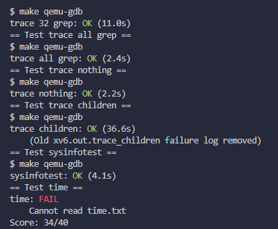

# Lab - System Calls

Lab2 主要是自己实现一些系统调用，理解系统调用的过程。

## tracing 系统调用

tracing实现的功能就是跟踪某个你选中的系统调用！

根据hint提示其实可以知道所有的系统调用都被声明在user/user.h当中，但是此处只是声明，用于用户态视为库函数调用。细看用户态的trace库函数

```c
#include "kernel/param.h"
#include "kernel/types.h"
#include "kernel/stat.h"
#include "user/user.h"

int
main(int argc, char *argv[])
{
  int i;
  char *nargv[MAXARG];

  if(argc < 3 || (argv[1][0] < '0' || argv[1][0] > '9')){
    fprintf(2, "Usage: %s mask command\n", argv[0]);
    exit(1);
  }

  if (trace(atoi(argv[1])) < 0) {
    fprintf(2, "%s: trace failed\n", argv[0]);
    exit(1);
  }
  
  for(i = 2; i < argc && i < MAXARG; i++){
    nargv[i-2] = argv[i];
  }
  exec(nargv[0], nargv);
  exit(0);
}

```

其主要的作用其实就是调用trace库函数，然后将trace mask 从参数列表中删除，而后用exec执行后续的库函数。

所以trace的实现到底在哪里。

>[!tip] 这实际设计到用户态和系统态之间的交互，官方的文档是这么说的：The Makefile invokes the perl script user/usys.pl, which produces user/usys.S, the actual system call stubs, which use the RISC-V ecall instruction to transition to the kernel.<br>也就是Makefile调用perl脚本user/usys.pl，它生成user/usys.S，实际的系统调用存根，它使用RISC-V ecall指令转换到内核。再在内核中执行对应的系统调用。

因此我们追踪到内核的系统调用中：kernal/syscall.c，通过其中的syscall函数可以知道简单的流程
```c
void
syscall(void)
{
  int num;
  struct proc *p = myproc();

  num = p->trapframe->a7;
  if(num > 0 && num < NELEM(syscalls) && syscalls[num]) {
    // Use num to lookup the system call function for num, call it,
    // and store its return value in p->trapframe->a0
    p->trapframe->a0 = syscalls[num]();

  } else {
    printf("%d %s: unknown sys call %d\n",
            p->pid, p->name, num);
    p->trapframe->a0 = -1;
  }
}
```
当触发系统调用时，会去检查当前进程的a7寄存器的值，表示对应要执行那个系统调用，紧接着执行对应的系统调用，syscalls内存放的时每个系统调用的函数指针。

因此我们需要做的前几步就是
1. 先在用户态中将trace库函数与内核中的系统调用进行绑定，其实就是在user/user.h，usys.pl中添加trace表示
2. 在syscall.h 中添加trace的索引值，并在syscall.c 中添加trace的函数声明，并加入到系统调用函数指针数组当中。
3. 在sysproc.c 中实现trace系统调用。

**如何实现trace**

首先要么要记得在用户态调用库函数时传入了一个mask参数，用于表示要追踪什么系统调用，而追踪过程是在一个进程中唯一的，所以显然我么需要将mask参数保存在进程的信息中，也就是进程PCB当中，这个在代码中其实可以通过myproc系统调用得到当前进程的PCB信息。

```c
uint64
sys_trace(void)
{
  int mask;
  
  // 内核态无法直接获取用户态的参数，需要用argint等方法通过寄存器获取参数。
  if (argint(0, &mask), mask < 0) {
    return -1;
  }

  // myproc返回当前进程的proc结构体 
  myproc()->syscall_trace = mask;
  return 0;
}
```

>[!note] 还需要注意的就是内核态是不能直接获取到用户态参数的，所以这里使用argint系统调用获取寄存器中的内容（参数）

现在trace的mask已经设置好了，只要在每次触发系统调用的时候检查一下这个系统调用的编号（索引）是不是和mask相同，相同则输出追踪信息。触发系统调用在syscall函数当中：
```c
void
syscall(void)
{
  int num;
  struct proc *p = myproc();

  num = p->trapframe->a7;
  if(num > 0 && num < NELEM(syscalls) && syscalls[num]) {
    // Use num to lookup the system call function for num, call it,
    // and store its return value in p->trapframe->a0
    p->trapframe->a0 = syscalls[num]();
    
    // 因为mask的设计时 1 << mask_p, 所以检查是否包含当前系统调用，即就右移对应值和1相与
    if ((p->syscall_trace >> num) & 1) {
      printf("%d: syscall %s -> %d\n", p->pid, syscall_names[num], p->trapframe->a0);
    }
  } else {
    printf("%d %s: unknown sys call %d\n",
            p->pid, p->name, num);
    p->trapframe->a0 = -1;
  }
}
```

>[!note] 对于系统调用在用户态和内核态的触发过程，在该网站有更为详细的解释 https://ttzytt.com/2022/07/xv6_lab2_record/


## Sysinfo 系统调用

这个系统调用主要就是显示当前系统中的内存情况和进程数目

>[!note] 但是qemu架构中并没有直接给我们提供获取空闲内存和正在运行的进程数目的函数，因此我们需要自己实现。

根据hints观察kalloc.c，可以发现我们想要获取系统资源信息，首先都需要获取系统内存访问锁，紧接着通过kmem.freelist可以获取当前系统中的空闲链表（x86架构使用的是空闲链表法）所以想要得到所有全部可用空闲区域的大小，就是不断遍历空闲链表。遍历结束后需要记得释放锁。

```c
uint64
count_free_mem(void)
{
  // 获取系统信息资源必须先锁内存管理，防止竞争（在后面的课程出现）
  acquire(&kmem.lock);

  // 统计空闲页数 * 页的大小就是空闲的内存字节数目
  uint64 mem_bytes = 0;
  // x86使用空闲链表法分配内存
  struct run *r = kmem.freelist;
  while (r) {
    mem_bytes += PGSIZE;
    r = r->next;
  }

  // 获取完释放锁
  release(&kmem.lock);
  return mem_bytes;
}
```

那么如何获取进程的数目呢？

这个就相对简单一点，因为所有的进程都保存在进程列表proc中（kernal/proc.c），只需要遍历所有的进程，遇到进程状态不为UNUSED的进程时让计数器自增即可。

```c
// 统计进程中状态不等于UNUSED的进程数
uint64
count_process(void)
{
  uint64 cnt = 0;
  for (struct proc *p = proc; p < &proc[NPROC]; p ++) {
    if (p->state != UNUSED) {
      cnt ++;
    }
  }
  return cnt;
}
```

最后在sysproc.c中实现具体实现

```c
// 打印系统信息
uint64
sys_sysinfo(void)
{
  // 从用户态读取一个指针，作为sysinfo的结构的缓冲区
  uint64 addr;
  argaddr(0, &addr);

  struct sysinfo sinfo;
  sinfo.freemem = count_free_mem();
  sinfo.nproc = count_process();

  if (copyout(myproc()->pagetable, addr, (char *)&sinfo, sizeof(sinfo)))
    return -1;
  return 0;
}
```
>>[!note] 同样千万不要忘记和trace一样在用户态和syscall当中声明系统调用的基本配置内容

## 通关截图

