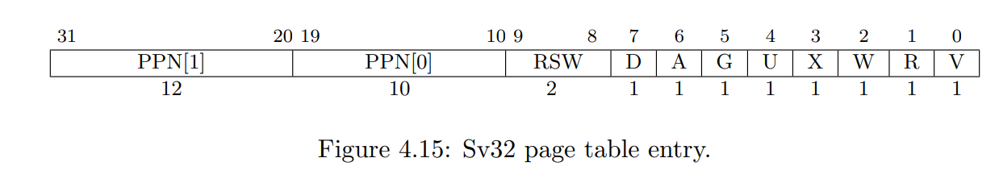

# Lab pgtbl: Page tables

## Speed up system calls

> 为了加速系统调用，很多操作系统都会在用户空间内开辟一些只读的虚拟内存，内核会把一些数据分享在这里。这样就可以减少来回在用户态和内核态中切换的操作。我们需要用这个方法给 getpid() 加速。

实际就是希望在创建进程的同时，就把pid放到共享空间的结构体当中，这样用户态在查pid的时候实际就不需要用ecall切换到内核态了。

思路：

1. 先创建一个新的一页page用于保存共享内容，需要将这一页通过mappages函数将虚拟页面和物理页面进行映射
2. 寻找一个创建进程时必定会执行的函数（proc_pagetable很合适，为每个进程创建用户页表）在调用该函数时调用mappages创建一个共享内存页
3. 同样的在创建进程时新增了一个共享内存页，关闭进程时同样也要对应的清除
4. 一定要注意在创建进程的时候，还要为这个虚拟内存申请真实的物理内存，不然映射的就是空指针。


```cpp
========proc_pagetable==========
 // 增加内核和用户共享页
  if (mappages(pagetable, USYSCALL, PGSIZE, (uint64)(p->usyscall), PTE_R | PTE_U) < 0) {
    // 如果当前这一页没有映射成功，我们需要把之前成功映射的 uvmunmap() 了。并且把映射失败的这一页 uvmfree()
    uvmunmap(pagetable, TRAMPOLINE, 1, 0);
    uvmunmap(pagetable, TRAPFRAME, 1, 0);
    uvmfree(pagetable, 0);
    return 0;
  }


========proc_freepagetable=========
void
proc_freepagetable(pagetable_t pagetable, uint64 sz)
{
  uvmunmap(pagetable, TRAMPOLINE, 1, 0);
  uvmunmap(pagetable, TRAPFRAME, 1, 0);
  uvmunmap(pagetable, USYSCALL, 1, 0);
  uvmfree(pagetable, sz);
}

=======allocproc========
// 给内核和用户共享的页表项分配页
  if ((p->usyscall = (struct usyscall *)kalloc()) == 0) {
    freeproc(p);
    release(&p->lock);
    return 0;
  }
```

## Print a page table

> 实现一个函数vmprint(), 用于打印当前的页表信息

```cpp
=========vm.c===========
void vmprint(pagetable_t pagetable, uint64 depth) {
  if (depth == 0) 
    printf("page table %p\n", pagetable);
  for (int i = 0; i < 512; i ++) {
    pte_t pte = pagetable[i];
    if ((pte & PTE_V)) {
      uint64 child = PTE2PA(pte);
      for (int j = 0; j <= depth; j ++) {
        printf(" ..");
      } 
      printf("%d: pte %p pa %p\n", i, pte, child);
      if (depth < 2) 
        vmprint((pagetable_t)child, depth + 1);
    }
  }
}


=========exec.c: init()===========
if(p->pid == 1)
    vmprint(p->pagetable, 0);
```


## Detect which pages have been accessed

> 实现pgaccess函数，当访问时会打印出每个页表的是否被访问过

如何确认某个页表是否被访问过。这个就需要用到 PTE 中的标志位（A表示已访问，D表示脏位已被修改）




```cpp
int
sys_pgaccess(void)
{
  // lab pgtbl: your code here.
  // 获取本进程的页表
  pagetable_t pagetable = myproc()->pagetable;
  // fir表示第一个检测的页表，mask表示页表访问信息存到哪里
  uint64 fir_addr, mask_addr;
  int pg_size;
  uint64 mask = 0;
  // 尝试从参数列表中获取三个参数
  if (argaddr(0, &fir_addr), fir_addr == -1) {
    return -1;
  } 
  if (argint(1, &pg_size), pg_size == -1) {
    return -1;
  }
  if (argaddr(2, &mask_addr), mask_addr == -1) {
    return -1;
  }
  // 设置可以一次访问的页数为32
  if (pg_size > 32) {
    return -1;
  }

  pte_t* pte = walk(pagetable, fir_addr, 0);

  for (int i = 0; i < pg_size; i++) {
    if ((pte[i] & PTE_A) && (pte[i] & PTE_V)) {
      mask |= (1 << i);
      pte[i] ^= PTE_A; // 确定过了就复位，重新标记回没访问过
    }
  }

  // 把mask数据拷贝到用户页表的mask_addr地址上。
  if (copyout(pagetable, mask_addr, (char*) &mask, sizeof(uint))) {
    return -1;
  }
  return 0;
}
```