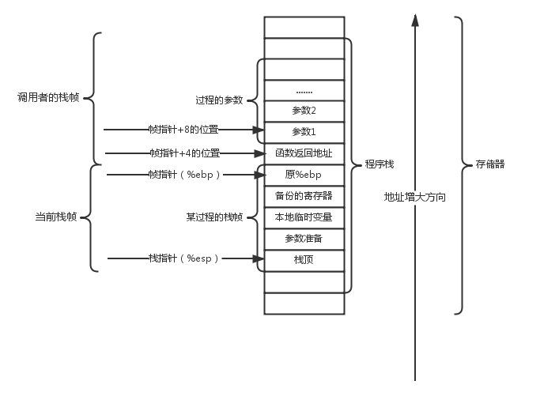

# Lab Traps

## Backtrace

> 实现一个backtrace函数，该函数的作用是只要某个程序调用了这个函数，该函数就会输出这个程序的“函数调用顺序”

核心是要理解栈帧的调用过程：



>[!tip] main函数在调用一个函数的时候，首先需要保存当前运行代码的PC值，然后需要将当前栈帧的bp（帧指针）压入栈中，紧接着将新栈帧的bp设置维当前栈帧的sp

如果想要获取调用过程，实际就是不断的获取当前函数调用的调用者的bp不断的回溯追踪，通常可以用GCC的内联汇编实现这个需求，应为s0寄存器存放的就是帧指针，所以可以通过汇编直接将该寄存器的值返回出来

```cpp
static inline uint64
r_fp()
{
  uint64 x;
  asm volatile("mv %0, s0" : "=r" (x) );
  return x;
}
```

剩下就是类似于递归回溯的过程, 知识需要注意一连串的函数调用，所有的栈帧实际是放在一个物理页中，所以我们必须确保我们栈指针在这一页的有效范围内，如果不在了则说明已经访问结束了。

```cpp
void 
backtrace(void)
{
  printf("in bt\n");
  // 获取当前帧指针, r_fp的返回值虽然是uint64，但是由于返回值是帧指针，是一个内存地址，
  // 所以本质是一个指针的感觉，所以可以强制转换成一个同样大小的指针类型，这样可以更方便的用指针的方式操作内存数据
  uint64* cur_frame = (uint64*)r_fp();
  // 获取当前函数调用的所在的帧页面的上下界, 需要注意top更大，因为栈顶在下
  uint64* top = (uint64*)PGROUNDUP((uint64)cur_frame);
  uint64* bottom = (uint64*)PGROUNDDOWN((uint64)cur_frame);
  while(cur_frame < top && cur_frame > bottom) {
    // 打印被调用者的地址，返回地址在fd的-8个字节处，而且cur_frame大小是64，所以-1就是减去了8个字节
    printf("%p\n", *(cur_frame - 1));
    // 将cur_frame指向被调用者的fd
    cur_frame = (uint64*)*(cur_frame - 2);
  }
}
```

## Alarm

> 实现一个 sigalarm(interval, handler) 的系统调用。及每过 interval 个时钟周期，就执行一遍 handler 这个函数。<br>此外还要实现一个 sigreturn() 系统调用，如果 handler 调用了这个系统调用，就应该停止执行 handler 这个函数，然后恢复正常的执行顺序。如果说 sigalarm 的两个参数都为 0，就代表停止执行 handler 函数。

本质上要理解陷入的过程，相当于对一个handler加了一个定时器（或者说是监听器），所以我们必须首先在proc结构体中增加一些变量，用于表示当前进程的是否增加了警告的监听器：

```cpp
struct proc {

  ......

  uint64 alarm_tks; // 记录用于执行handler的间隔，0表示不执行
  void (*alarm_handler)(); // handler的地址
  uint64 alarm_tk_elapsed; // 距离上次执行handler的时间间隔

  struct trapframe *alarmframe; // 用于保存调用警告前的栈帧环境
  uint alarm_state; // 用于表示当前警告是否结束，避免重复进入导致循环不结束
};
```

需要注意由于系统调用在内核，我们不能直接通过传参的方式获得，需要借助栈帧保存的寄存器获得：
```cpp
uint64
sys_sigalarm(void)
{
  int ticks;
  struct proc* p = myproc();
  uint64 handler;
  if (argint(0, &ticks), ticks == -1) {
    return -1;
  }
  if (argaddr(1, &handler), handler == -1) {
    return -1;
  }
  p->alarm_tks = ticks;
  p->alarm_handler = (void(*)())handler;
  p->alarm_tk_elapsed = 0;
  return 0;
}
```
>[!note] 需要注意的就是函数指针的声明方式和类型转换

什么时候调用呢？<br> 其实就是在每个时钟时间结束后检查当前的时间间隔是否满足再次调用，满足则需要调用，由于我们是在trap的时候调用，所以实际上可以直接将pc指向handler

```cpp
// give up the CPU if this is a timer interrupt.
  // 时钟中断
  if(which_dev == 2) {
    if (p->alarm_tks > 0) {
      p->alarm_tk_elapsed ++; // 距离上次间隔+1
      // 如果间隔抄出了重复警告的时间则警告
      if (p->alarm_tk_elapsed > p->alarm_tks && p->alarm_state == 0) {
        // 指向警告函数前先备份一下当前的环境
        *p->alarmframe = *p->trapframe;
        p->alarm_tk_elapsed = 0; // 复原
        // 并将pc指向警告函数的起始地址
        p->trapframe->epc = (uint64)p->alarm_handler;
        p->alarm_state = 1;
      }
    }
    yield();
  }
```


同样的，我们现在有监听器后，应该在特定的条件下或者人为调用sigreturn系统调用退出监听，如何退出监听，关键在于如何恢复原本的被中断的栈帧信息<br> 可以注意到栈帧信息在陷入前已经存到alarmframe当中，所以进行类似的恢复即可

```cpp
uint64
sys_sigreturn(void) {
  struct proc* p = myproc();
  *p->trapframe = *p->alarmframe;
  p->alarm_state = 0;
  return p->trapframe->a0;  // 针对test3，返回的就是之前的系统调用的返回结果，同时避免影响其他的系统调用
}
```