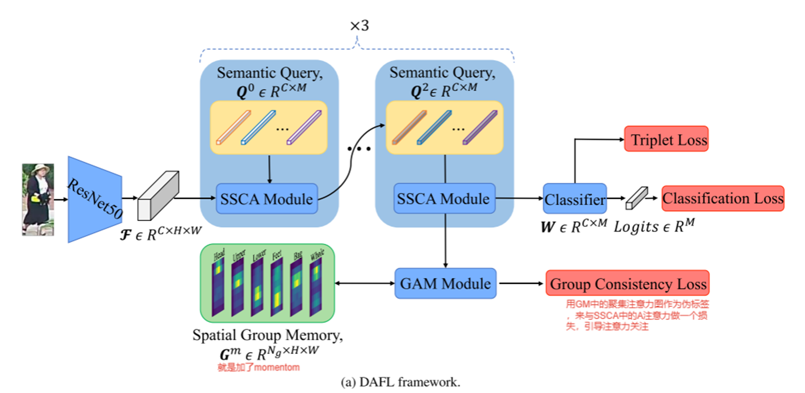

# 行人属性识别

## 基于解耦表征学习的行人属性识别

> Learning Disentangled Attribute Representations for Robust Pedestrian Attribute Recognition

### 研究现状：

    现有的行人属性识别方法，通常采用学习一个共享的行人图像特征来对多个属性进行分类。
    但是这种机制会导致在模型推理阶段的鲁棒性和置信度降低。
    现有的方法可分为如下几类：
    1. 提取一个共享的全局特征来对所有属性进行分类
        (HydraPlusNet、MsVAA、VAC、JLAC)
    2. 根据属性的空间分布将属性分成若干组，采用一组特征对同一组中的多个属性进行分类
        （RC&RA、VSGR）
    3. 试图为每个属性提取一个特定的特征

### 采用共享的全局特征为什么存在问题？
>[!note]
我们假设对于第j个属性，第i个样本，该样本在经过最后的分类层之后输出结果设为$logits_{i,j}$，此时第i个样本预测为第j个属性的概率为$p_{i,j}=\sigma(logits_{i,j})$，$\sigma$就是Sigmoid函数。我们默认设定预测的阈值$p_t=0.5$，则有$\hat{y}_{i, j}=\left\{\begin{array}{ll}
1, & p_{i, j}>=p_{t} \\
0, & p_{i, j}<p_{t}
\end{array},\right.$
>
>继续假定$logits_{i,j}=w^T_jf_i=|w_j|*|f_i|·cos\theta$，其中$w_j$表示第j个属性的权重向量，$f_i$则是共享的$x_i$样本特征向量。  将上述式子进行整合，可以得到$\hat{y}_{i, j}=\left\{\begin{array}{ll}
1, & 0^{\circ}<=\theta<=90^{\circ} \\
0, & 90^{\circ}<\theta<180^{\circ}
\end{array} \right.$  此时可以看出我们最后的预测结果只和$cos\theta$相关，而$\theta$就是特征向量$f$和属性分类权重向量$w$的夹角。  因此，对于一个目标属性，一个经过良好训练的模型应该使正样本特征与对应的分类器权重之间的角度尽可能小，甚至接近0 °，这意味着高置信度的预测。 但是在实验中观测到，属性分类的权重向量大多是正交的，而从直观上就可以发现两者既然正交，那么必然不可能使得共享的特征向量和多个属性权重向量的角度都接近于0°。然而角度越接近于0°时意味着模型的置信度越高，所以需要进一步去推测理论上最佳的角度是多少？  **答： **
**在二分类属性情况下，最佳的共享特征向量应该位于两个分类器的中间，也就是到两个分类器距离相同，即与两个分类权重向量的角度$\theta=45°$；进一步推广到三分类属性情况下，最佳的$\theta=54.74$。** **我们得出结论，最合适的样本特征$f_i$通过最小化二进制交叉熵损失实现了自身与多个分类器之间的距离的权衡。该属性使最佳角度随着属性数量的增加而收敛到90 °。具体而言，在现有数据集PA 100k、PETA和RAP上，属性θ分别为26、35、51，最佳角度分别为78,69°、80.27°、81.27°**。
>

    
收敛曲线图：

    
>

>
>然而，训练阶段接近90°的最佳角度与我们的预期相去甚远。因此，微小的扰动可能会使测试集的特征越过决策边界，导致测试集的角度大于90°，并产生错误的预测。具体地说，学习到的特征容易受到行人姿势、光照和背景变化的影响，导致不正确的分类。因此，我们得出结论，通过OFMA机制学习的共享特征离分类器太远，这降低了模型在测试集上的稳健性。此外，值得注意的是，这一缺陷是由OFMA机制确定的，与具体方法无关。

>[!tip]
>什么，如果你问我怎么才能像文中说的计算出不同类别数情况下的最佳角度$\theta$。说实话，论文没说明我也不知道！

### 为了解决上述问题，本文提出了DAFL架构。

>[!tip]
>DAFL架构主要由连续的SSCA模块和GAM模块组成

#### SSCA模块
> 该模块的提出用于为每个属性定位在空间中的区域，并将区域特征汇聚成一个属性特征

    

对于第s个SSCA模块（因为是级联的），其输入包括两部分：1. 语义查询$Q^S\in R^{C \times M}$(对于第一个SSCA有点类似于attention中的Q，是一个学习出来的向量，对于后续的SSCA模块，其Q就是上一个SSCA的输入特征图)；2. 特征图$\mathcal{F} \in R^{C \times H \times W}$
作者在SSCA模块中进一步参考Transformer的MHA，对于SSCA模块内部的计算同样仿照多头注意力机制进行设计。SSCA模块的输出一个查询注意力图$A \in R^{M \times H \times W}$ 和 属性特征图$F^s \in R^{C \times M}$，其中$A=Softmax(\frac{\theta (Q)^T \phi (\mathcal{F})}{\sqrt(C)})$ ，$F^s = A\psi(\mathcal{F})^T$。(公式中的$\theta(Q),\phi (\mathcal{F})和 \psi(\mathcal{F}) $实际就是两个线性映射，和Transformer的QKV一个道理)
>[!note]除了第一个SSCA模块的$Q^0$是随机初始化的，后续的SSCA模块的Q^s实际是前一个SSCA模块的输出$F^{s-1}$
#### GAM模块