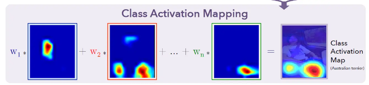
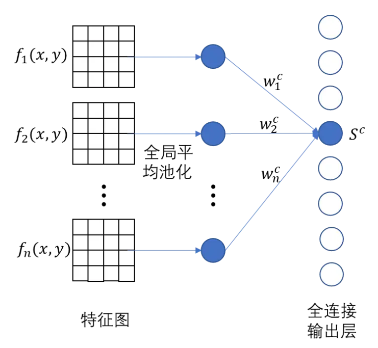

# CAM (Class Activation Mapping, 类激活映射)

## 简述：

> 论文《Learning Deep Features for Discriminative Localization》发现了CNN分类模型的一个有趣的现象：<br>CNN的最后一层卷积输出的特征图，对其通道进行加权叠加后，其激活值（ReLU激活后的非零值）所在的区域，即为图像中的物体所在区域。而将这一叠加后的单通道特征图覆盖到输入图像上，即可高亮图像中物体所在位置区域。


**CAM一般有两种用途：**

- 可视化模型特征图，以便观察模型是通过图像中的哪些区域特征来区分物体类别的；
- 利用卷积神经网络分类模型进行弱监督的图像目标定位。



>[!tip] 就像图中所示，对于我们全连接的一个神经元$S_c=\sum_kw_k^c\frac{1}{|x,y|}\sum_{x,y}f_k(x,y)=\frac{1}{|x,y|}\sum_{x,y}\sum_kw_k^cf_k(x,y)$<br> 其中我们将$\frac{1}{|x,y|}\sum_{x,y}f_k(x,y)$视为全局池化操作，也就是说我们先池化后加权求和后的结果与先对每个特征图进行加权求和后再平均池化的的结果是一致的。而采用第二种方式的好处在于，我们加权后的结果是二维的，保留了图像的空间信息，因此可以可视化图像中的相对位置激活信息。

## PyTorch实现：

以ResNet-18为例：
```python
import math
import torch
from torch import Tensor
from torch import nn
import torch.nn.functional as F
from typing import Optional, List
import torchvision.transforms as transforms
from PIL import Image
import torchvision.models as models
from torch import Tensor
from matplotlib import cm
from torchvision.transforms.functional import to_pil_image

import math
import torch
from torch import Tensor
from torch import nn
import torch.nn.functional as F
from typing import Optional, List
import torchvision.transforms as transforms
from PIL import Image
import torchvision.models as models
from torch import Tensor
from matplotlib import cm
from torchvision.transforms.functional import to_pil_image
import numpy as np

if __name__ == '__main__':

    img_path = 'data/bird.jpg'
    save_path = 'data/bird_CAM.png'

    preprocess = transforms.Compose([transforms.Resize(256),
                                     transforms.CenterCrop(224),
                                     transforms.ToTensor(),
                                     transforms.Normalize([0.485, 0.456, 0.406], [0.229, 0.224, 0.225])])

    model = models.resnet18(pretrained=True).cuda()

    # 由于特征图是模型前向传播时的中间变量，不能直接从模型中获取，需要用到PyTorch提供的hook工具

    feature_map = []

    # 定义前向传播的hook
    def forward_hook(module, input, output):
        feature_map.append(output)

    model.layer4.register_forward_hook(forward_hook)

    orign_img = Image.open(img_path).convert('RGB')  # 打开图片并转换为RGB模型
    img = preprocess(orign_img)  # 图片预处理
    img = torch.unsqueeze(img, 0)  # 增加batch维度 [1, 3, 224, 224]

    with torch.no_grad():
        out = model(img.cuda())  # 前向传播

    print(feature_map[0].size())

    # CAM使用的权重是全连接输出层中，对应这张图像所属类别的权重。
    cls = torch.argmax(out).item()  # 获取预测类别编码

    weights = model._modules.get('fc').weight.data[cls, :]  # 获取类别对应的权重

    # 对特征图的通道进行加权叠加，获得CAM, features_map[0].squeeze(0) -> (512, 7, 7) -> (7, 7)
    # weight -> (512, 1, 1), 使得可以在第0维进行对应的权重乘法
    cam = (weights.view(*weights.shape, 1, 1) * feature_map[0].squeeze(0)).sum(0)

    # 对CAM进行ReLU激活和归一化
    # 上步得到的类激活图像素值分布杂乱，要想确定目标位置，须先进行ReLU激活，将正值保留，负值置零。像素值正值所在的（一个或多个）区域即为目标定位区域。
    # 获得的激活图还只是一个普通矩阵，需要变换成图像规格，将其值归一化到[0, 1]之间。
    def _normalize(cams: Tensor) -> Tensor:
        """CAM normalization"""
        cams.sub_(cams.flatten(start_dim=-2).min(-1).values.unsqueeze(-1).unsqueeze(-1))
        cams.div_(cams.flatten(start_dim=-2).max(-1).values.unsqueeze(-1).unsqueeze(-1))

        return cams


    cam = _normalize(F.relu(cam, inplace=True)).cpu()
    # 将类激活图转换成PIL格式是为了方便下一步和输入图像融合，因为本例中我们选用的PIL库将输入图像打开，选用PIL库也是因为PyTorch处理图像时默认的图像格式是PIL格式的。
    mask = to_pil_image(cam.detach().numpy(), mode='F')

    # 将类激活图覆盖到输入图像上，实现目标定位
    def overlay_mask(img: Image.Image, mask: Image.Image, colormap: str = 'jet', alpha: float = 0.6) -> Image.Image:
        """Overlay a colormapped mask on a background image

        Args:
            img: background image
            mask: mask to be overlayed in grayscale
            colormap: colormap to be applied on the mask
            alpha: transparency of the background image

        Returns:
            overlayed image
        """

        if not isinstance(img, Image.Image) or not isinstance(mask, Image.Image):
            raise TypeError('img and mask arguments need to be PIL.Image')

        if not isinstance(alpha, float) or alpha < 0 or alpha >= 1:
            raise ValueError('alpha argument is expected to be of type float between 0 and 1')

        cmap = cm.get_cmap(colormap)
        # 将得到类激活图差值放大到img大小
        overlay = mask.resize(img.size, resample=Image.BICUBIC)
        # 设置调色盘
        overlay = (255 * cmap(np.asarray(overlay) ** 2)[:, :, 1:]).astype(np.uint8)
        # 将激活图和原图叠加
        overlayed_img = Image.fromarray((alpha * np.asarray(img) + (1 - alpha) * overlay).astype(np.uint8))

        return overlayed_img


    result = overlay_mask(orign_img, mask)
    result.show()
    result.save(save_path)
```
>[!note] 注意内部的两个函数