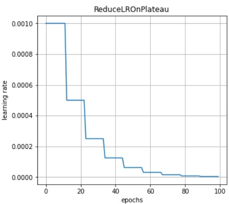
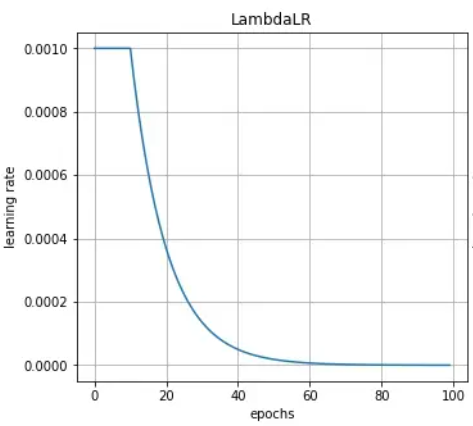
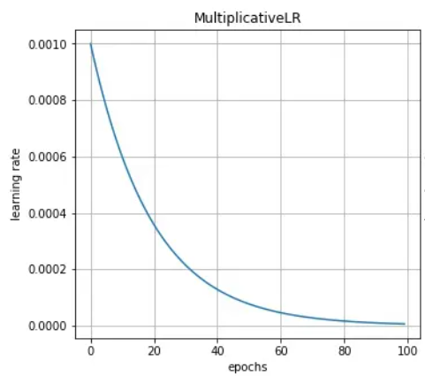
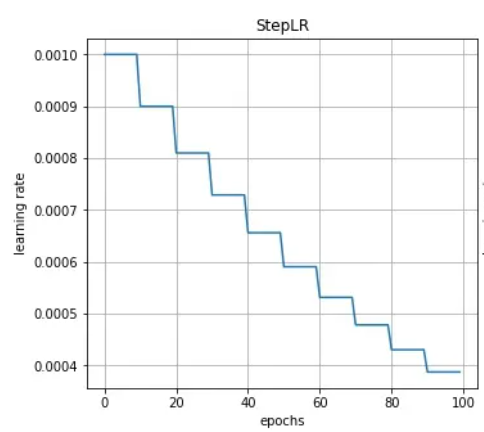
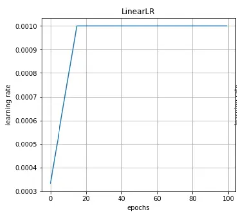
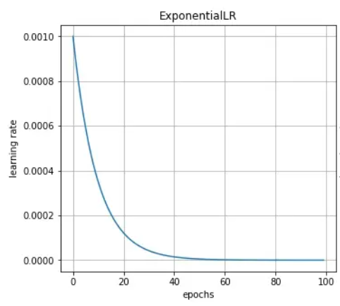
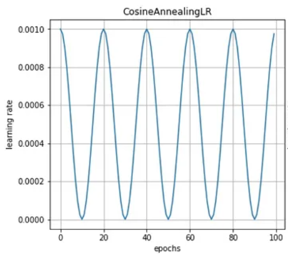
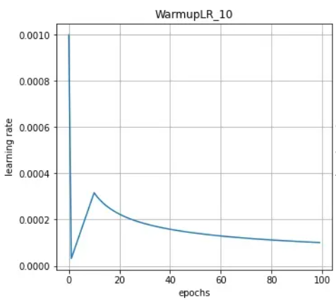

# 学习率调度器（lr_schedule）

## ReducelROnPlateau

> ReduceLROnPlateau是PyTorch中的一个动态学习率算法，它根据训练集上的loss值来自动调整学习率。<br> 该算法会在训练的过程中监控损失函数的值，并且在损失降低的速度变慢的时候，自动的减少学习率。当损失函数连续patient轮迭代都没有下降时，学习率则会减少一个因子factor

**主要参数：**
1. Optimizer： 被包装的优化器
2. mode： （'min' || 'max'）在min模式下，当检测到被监控的参数不再减少时降低学习率；在max模式下，当检测到没监控的参数不再增加时降低学习率。默认值：'min'
3. factor： 学习率降低的因子 -> new_lr = lr * factor
4. patience: 当监控的参数在patience个数的epoch内没有改善，则再次之后降低学习率。—> 如果 Patience = 2，那么我们将忽略前 2 个没有改善的 epoch，并且只有在第 3 个 epoch 之后损失仍然没有改善时才会降低学习率。默认值：10。

**示例代码：**
```python
optimizer = torch.optim.Adam(model.parameters(), lr=lr)
lr_scheduler = torch.optim.lr_scheduler.ReduceLROnPlateau(optimizer, 'min', patience=5, factor=0.5)
for epoch in range(num_epochs):
    train_loss = 0.0
    for i, data in enumerate(train_loader, 0):
        inputs, labels = data
        optimizer.zero_grad()
        outputs = model(inputs)
        loss = criterion(outputs, labels)
        loss.backward()
        optimizer.step()
        train_loss += loss.item()
    train_loss /= len(train_loader)
    lr_scheduler.step(train_loss)
```



## LambdalLR

> 也叫函数衰减： 需要自定义一个函数作为乘法因子控制衰减的过程。<br>
> $lr_\text{epoch }=lr_\text{initial}*\text{Lambda(epoch)}$

```python
torch.optim.lr_scheduler.LambdaLR(optimizer,lr_lambda,last_epoch=-1,verbose=False)

"""
Args:
 optimizer (Optimizer): 被封装的优化器
 lr_lambda (function or list): 计算乘法的函数，或此类的列表函数，optimizer.param_groups 中的每一组都有一个函数。
 last_epoch (int): 最后一个epoch的index，如果是训练了很多个epoch后中断了，继续训练，这个值就等于加载的模型的epoch。默认为-1表示从头开始训练，即从epoch=1开始。
 verbose (bool): 如果为“True”，则每次更新都会向标准输出打印一条消息。默认值：`False`。
"""
```
简单示例：
```python
import torch
from torch import nn
from torch.optim.lr_scheduler import LambdaLR
import numpy as np

NUM_EPOCHS = 100
model = nn.Linear(2, 1)

def scheduler_lr(optimizer, scheduler):
  lr_history = []

  """optimizer的更新在scheduler更新的前面"""
  for epoch in range(NUM_EPOCHS):
      optimizer.step() # 更新参数
      lr_history.append(optimizer.param_groups[0]['lr'])
      scheduler.step() # 调整学习率
  return lr_history


"""设置优化器，初始化学习率"""
optimizer = torch.optim.SGD(model.parameters(), lr=1e-3) 

"""设置lr策略"""
# 前10个epoch，学习率不变，10个epoch之后学习率指数下降
lr_lambda = lambda epoch:1.0 if epoch<10 else np.math.exp(0.1*(10-epoch))
scheduler = LambdaLR(optimizer=optimizer,lr_lambda=lr_lambda)
lr_history = scheduler_lr(optimizer, scheduler)
```




## MultiplicativeLR

> 每组参数的学习率乘以指定函数中给定的因子。（设置学习率为上一次的学习率乘以给定lr_lambda函数的值。）<br> $lr_{\text{epoch }}=lr_{\textit{epoch}-1}*Lambda\text{(epoch })$

简单示例：
```python
from torch.optim.lr_scheduler import MultiplicativeLR
optimizer = torch.optim.SGD(model.parameters(), lr=1e-3)
lmbda = lambda epoch: 0.95
scheduler = MultiplicativeLR(optimizer,lmbda)
lr_history = scheduler_lr(optimizer, scheduler)
```



## StepLR:

> 固定步长衰减：  StepLR则是类似于越阶式的衰减方式，它的衰减是一个断崖式的下落。在每经过固定的epoch之后，lr 就会乘以一次gamma，即衰减为原来的gamma倍。<br> $\left.lr_\text{epoch }=\left\{\begin{array}{ll}\text{Gamma }*lr_{\text{epoch-1}},&\text{if epoch }\%\text{stepsize }=0\\lr_{\text{epoch -1}},&\text{otherwise}\end{array}\right.\right.$

```python
torch.optim.lr_scheduler.LambdaLR(optimizer, step_size, gamma=0.1, last_epoch=-1, verbose=False)
"""
Args:
 optimizer (Optimizer): Wrapped optimizer.
 step_size (int): Period of learning rate decay.
 gamma (float): Multiplicative factor of learning rate decay.
 last_epoch (int): The index of last epoch. Default: -1.
 verbose (bool): If ``True``, prints a message to stdout for each update.Default: ``False``.
"""
```

简单示例：
```python
from torch.optim.lr_scheduler import StepLR
optimizer = torch.optim.SGD(model.parameters(), lr=1e-3)
scheduler = StepLR(optimizer=optimizer, step_size=10, gamma=0.9)
lr_history = scheduler_lr(optimizer, scheduler)
```



## LinearLR

> 通过线性改变小的乘法因子来衰减每个参数组的学习率，直到 epoch 的数量达到预定义的milestone：total_iters。

```python
torch.optim.lr_scheduler.LinearLR(optimizer, start_factor=0.3333333333333333, end_factor=1.0, total_iters=5, last_epoch=- 1, verbose=False)

""""
Args:
 optimizer (Optimizer): Wrapped optimizer.
 start_factor (float): 与第一个epoch相乘.
 end_factor (float): 在线性变化结束时乘以学习率.
 total_iters (int): 乘法因子达到 1 的迭代次数。
 last_epoch (int): The index of the last epoch. Default: -1.
 verbose (bool): If ``True``, prints a message to stdout for each update. 
"""
```

简单示例：
```python
from torch.optim.lr_scheduler import LinearLR
optimizer = torch.optim.SGD(model.parameters(),lr=1e-3)
scheduler = LinearLR(optimizer=optimizer,start_factor=1.0/3,end_factor=1.0,total_iters=15)
lr_history = scheduler_lr(optimizer, scheduler)
```



## ExponentialLR

> 指数衰减，就是每一个epoch都会衰减的StepLR，其gamma就是对应的底数，epoch就是指数。<br> $lr_{\text{epoch }} =\text{Gamma}*lr_{\text{epoch -}1}$

简单示例：
```python
from torch.optim.lr_scheduler import ExponentialLR
optimizer = torch.optim.SGD(model.parameters(), lr=1e-3)
scheduler = ExponentialLR(optimizer=optimizer, gamma=0.9)
lr_history = scheduler_lr(optimizer, scheduler)
```



## CosineAnnealingLR

>余弦退火衰减会使学习率产生周期性的变化，其主要参数有两个，一个是$T_{max}$表示周期,一个是$\eta_{min}$ 表示学习率的最小值。<br> $\begin{aligned}\eta_t&=\eta_{min}+\frac12(\eta_{max}-\eta_{min})\left(1+\cos\left(\frac{T_{cur}}{T_{max}}\pi\right)\right),\quad&T_{cur}&\neq(2k+1)T_{max};\\\eta_{t+1}&=\eta_t+\frac12(\eta_{max}-\eta_{min})\left(1-\cos\left(\frac1{T_{max}}\pi\right)\right),\quad&T_{cur}&=(2k+1)T_{max}.\end{aligned}$

```python
torch.optim.lr_scheduler.CosineAnnealingLR(optimizer, T_max, 
     eta_min=0, last_epoch=-1, verbose=False)

"""
Args:
 optimizer (Optimizer): Wrapped optimizer.
 T_max (int): Maximum number of iterations.
 eta_min (float): Minimum learning rate. Default: 0.
 last_epoch (int): The index of last epoch. Default: -1.
  verbose (bool): If ``True``, prints a message to stdout for each update. Default: ``False``.

https://arxiv.org/abs/1608.03983
"""
```

简单示例：

```python
from torch.optim.lr_scheduler import CosineAnnealingLR
optimizer = torch.optim.SGD(model.parameters(), lr=1e-3)
scheduler = CosineAnnealingLR(optimizer=optimizer, T_max=10, eta_min=1e-6)
lr_history = scheduler_lr(optimizer, scheduler)
```



## warm up

> warm up衰减策略与上述的策略有些不同，它是先从一个极低的学习率开始增加，增加到某一个值后再逐渐减少。这样训练模型更加稳定，因为在刚开始时模型的参数都是随机初始化的，此时如果学习率应该取小一点，这样就不会使模型一下子跑偏。<br>随着训练的增加，逐渐的模型对数据比较熟悉，此时可以增大学习率加快收敛速度。最后随着参数逐渐收敛，在学习率增大到某个数值后开始衰减。<br> $lr=lr_\text{initial}*\min\left(\frac1{\sqrt{step}},\frac{step}{\text{warm}^{\frac32}}\right)$

简单示例：
```python
class WarmupLR:
 def __init__(self, optimizer, num_warm) -> None:
  self.optimizer = optimizer
  self.num_warm = num_warm
  self.lr = [group['lr'] for group in self.optimizer.param_groups]
  self.num_step = 0
 
 def __compute(self, lr) -> float:
  return lr * min(self.num_step ** (-0.5), self.num_step * self.num_warm ** (-1.5))
 
 def step(self) -> None:
  self.num_step += 1
  lr = [self.__compute(lr) for lr in self.lr]
  for i, group in enumerate(self.optimizer.param_groups):
      group['lr'] = lr[i]


optimizer = torch.optim.SGD(model.parameters(), lr=1e-3)
scheduler = WarmupLR(optimizer=optimizer, num_warm=10)
lr_history = scheduler_lr(optimizer, scheduler)
```



>[!note] 
以上是几个最常见的学习率优化器，后续会继续补充见到的一些使用的学习率调整策略